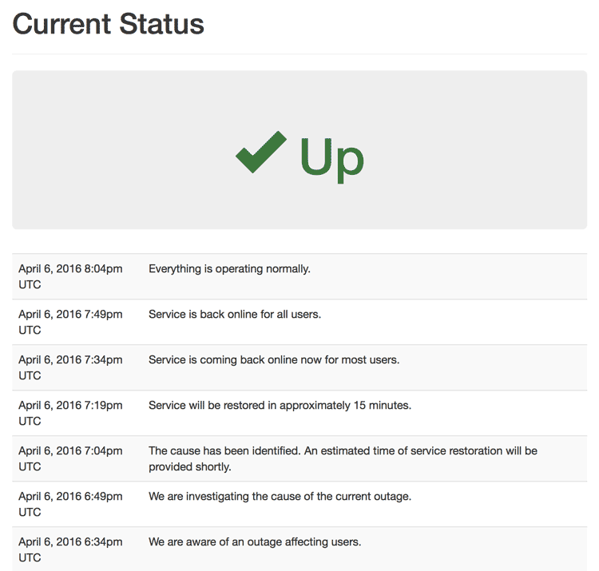

# Status

Overly simple status app that get's updated via a simple POST.

# Updating The Status

There are only two values: `status` and `message`. Both are optional.

`status` may be either `up` or `down`

`message` is a text status message.

Here are some cURL examples for updating the status.

The supported parameters are `status` and `message`. Both are optional.

    # Updating the status and the message together
    curl --data "status=down&message=Message%20About%20Status" http://currentstatus.dev
    
    # Just updating the message
    curl --data "message=Message%20About%20Status" http://currentstatus.dev
    
    # Just updating the status
    curl --data "status=up" http://currentstatus.dev

JSON is supported too.
    
    curl -H "Content-Type: application/json" -X POST -d '{"status":"up","message":"fiz bam"}' http://currentstatus.dev/

### Errors

If you post invalid data, you will get a non 200 status code response with the body containing an error message

Example:

    curl -H "Content-Type: application/json" -X POST -d '{"status":"foobar"}' http://currentstatus.dev/
    
    # Response:
    "Invalid Status"
    
# Testing

Run tests with `rake test`